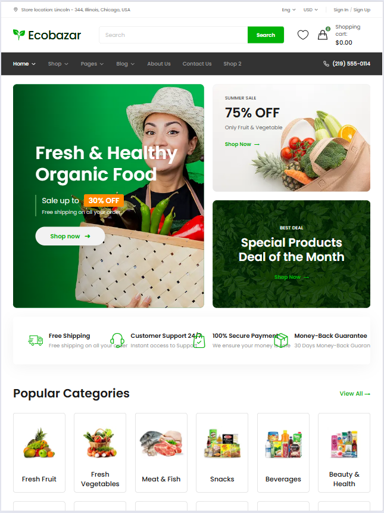
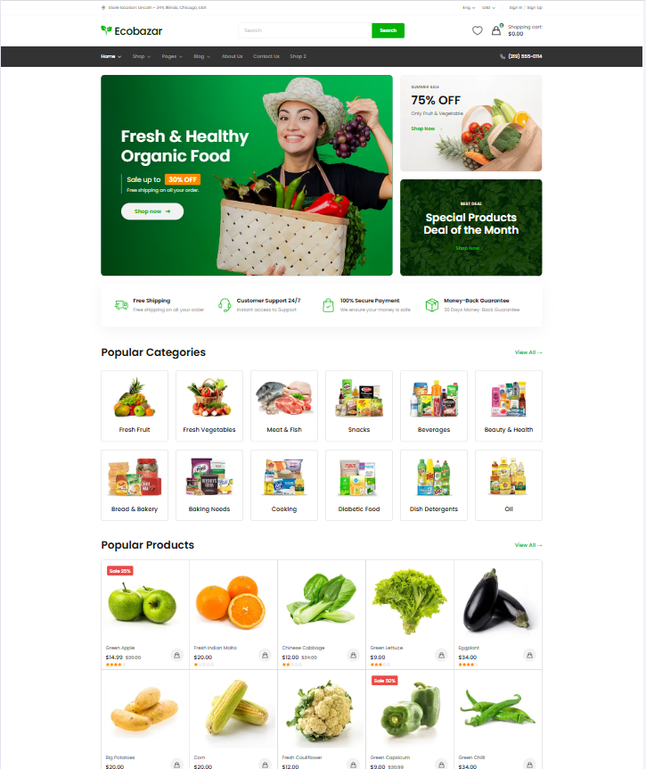

# Shopery – Organic eCommerce Shop Website

Đồ án xây dựng website thương mại điện tử thực phẩm hữu cơ của Nhóm 10. Giao diện được triển khai theo hướng Mobile First, hỗ trợ responsive trên điện thoại, máy tính bảng và máy tính để bàn.

## Thiết kế và sản phẩm

- Figma: [Shopery – Organic eCommerce Shop Website](https://www.figma.com/design/7Yxhcdszt6ACG00ICOukEk/Shopery---Organic-eCommerce-Shop-Website-Figma-Template--Community---Community---Copy-?node-id=629-3280&t=1ibCMH1JvizPgUVT-4)
- Website đã deploy: [https://organicecommerceshop-nhom10.vercel.app/](https://organicecommerceshop-nhom10.vercel.app/)
- GitHub: [organicecommerceshop_nhom10](https://github.com/vkhanh2012/organicecommerceshop_nhom10)

## Thành viên và phân công

| STT | Thành viên | MSSV | Trang phụ trách | Chức năng phụ trách |
| --- | --- | --- | --- | --- |
| 1 | Nguyễn Thị Vân Khánh | 2354050051 | About, Wishlist, Sign In, Shop, Shop 2 | Xây dựng trang About; xử lý đăng nhập và Wishlist; hiển thị Product Card; lọc, sắp xếp và phân trang sản phẩm trên Shop/Shop 2. |
| 2 | Trần Ngọc Lan Hương | 2354050048 | Trang chủ, Shopping Cart, Newsletter Popup, Sign Up | Xây dựng Homepage và Newsletter Popup; kiểm tra form đăng ký; xử lý đếm ngược; lưu và đồng bộ giỏ hàng bằng `localStorage`, cập nhật số lượng và tổng tiền theo thời gian thực. |
| 3 | Phạm Hữu Dũng | 2551050041 | Product Details, Checkout, Quick View, Description | Xây dựng Quick View và Product Details; xử lý thư viện ảnh, các tab mô tả, thêm vào giỏ; hiển thị Order Summary, chọn phương thức thanh toán và đặt hàng. |

## Chức năng chính

- Trang chủ giới thiệu sản phẩm, danh mục, Hot Deals và sản phẩm phổ biến.
- Trang Shop hỗ trợ lọc theo danh mục, giá, đánh giá, tag; sắp xếp và phân trang.
- Xem nhanh và xem chi tiết sản phẩm, thư viện ảnh và sản phẩm liên quan.
- Thêm sản phẩm vào Wishlist và Shopping Cart.
- Giỏ hàng được lưu bằng `localStorage` và đồng bộ giữa badge/tổng tiền trên Header, Cart Popup và trang Shopping Cart.
- Tăng hoặc giảm số lượng và cập nhật Subtotal, Shipping, Total theo thời gian thực.
- Đồng hồ đếm ngược lấy mốc thời gian từ dữ liệu và hiển thị trạng thái kết thúc khi hết giờ.
- Đăng nhập, đăng ký có kiểm tra dữ liệu và Checkout với nhiều phương thức thanh toán.
- Responsive theo ba nhóm màn hình: mobile, tablet và desktop.

## Công nghệ sử dụng

- HTML5
- JavaScript ES Modules
- Tailwind CSS 4
- Vite 8
- LocalStorage
- Vercel

## Cách chạy dự án

Yêu cầu máy đã cài [Node.js](https://nodejs.org/) và npm.

```bash
git clone https://github.com/vkhanh2012/organicecommerceshop_nhom10.git
cd organicecommerceshop_nhom10
npm install
npm run dev
```

Sau đó mở địa chỉ Vite hiển thị trong Terminal, thông thường là:

```text
http://localhost:5173/
```

Build và kiểm tra bản production:

```bash
npm run build
npm run preview
```

## Các trang chính

| Trang | Đường dẫn |
| --- | --- |
| Home | `/index.html` |
| Shop | `/shop.html` |
| About | `/about.html` |
| Product Details | `/descriptions.html?id=1` |
| Shopping Cart | `/cart.html` |
| Checkout | `/checkout.html` |
| Sign In | `/signin.html` |
| Sign Up | `/signup.html` |
| Wishlist | `/wishlist.html` |

## Screenshot responsive

Ảnh được kiểm tra ở ba breakpoint đại diện. Để cập nhật ảnh trong README, đặt file đúng tên tại thư mục `docs/screenshots/`.

### Mobile – 390 × 844px


### Tablet – 768 × 1024px



### Desktop – 1920 × 1080px



## Cấu trúc thư mục

```text
organicecommerceshop_nhom10/
├── src/
│   ├── about/
│   ├── checkout/
│   ├── components/
│   ├── data/
│   ├── descriptions/
│   ├── home/
│   ├── pages/
│   ├── Quickview/
│   ├── shop/
│   ├── shopping_cart/
│   └── css/
├── docs/
│   └── screenshots/
├── index.html
├── shop.html
├── package.json
└── README.md
```

## Ghi chú

- Dữ liệu sản phẩm được quản lý trong `src/data/products.json`.
- Không chỉnh sửa trực tiếp dữ liệu giỏ hàng trong DevTools khi đang sử dụng website.
- Nên kiểm tra Lighthouse trên bản production bằng `npm run preview` hoặc URL Vercel thay vì Vite development server.
